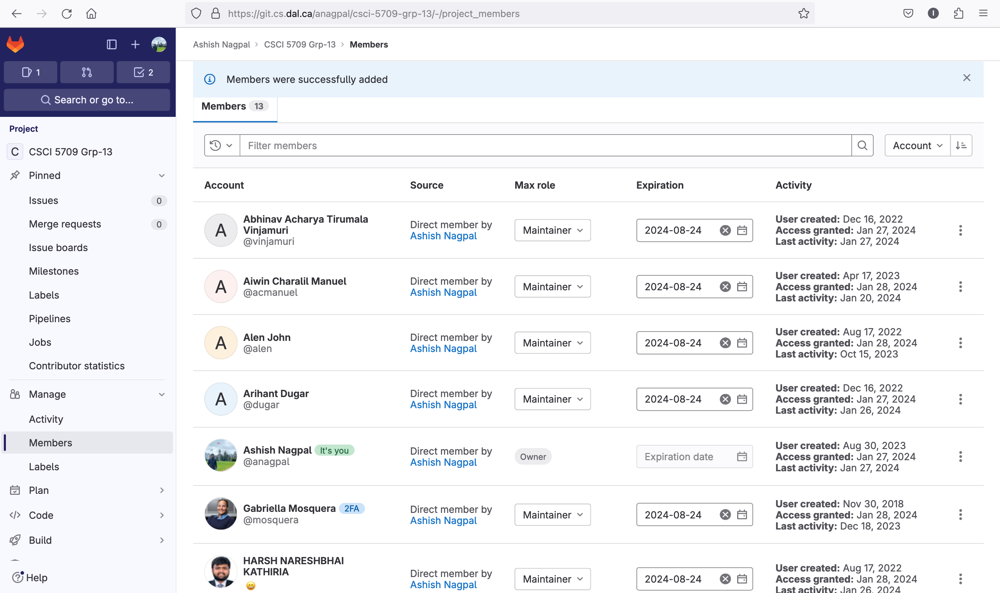

# Tutorial 2

**Individual Submission** 

* *Date Created*: _27 January 2024_
* *Last Modification Date*: _28 January 2024_
* *Gitlab URL*: [CSCI 5709 Tutorials](https://git.cs.dal.ca/anagpal/csci-5709-tutorials)


## Deliverables
- *Project Link*: [CSCI 5709 Grp-13](https://git.cs.dal.ca/anagpal/csci-5709-grp-13)

- *Tutotial Link*: [CSCI 5709 Tutorials](https://git.cs.dal.ca/anagpal/csci-5709-tutorials)

- *Assignment Link*: [CSCI 5709 Assignments](https://git.cs.dal.ca/anagpal/csci-5709-assignments)

- *Github Project Link*: [Adv-Web-Tutorial2](https://github.com/ashishnagpal2498/Adv-Web-Tutorial2)

- *Netlify Deployment*: [adv-web-deployment](https://adv-web-deployment.netlify.app/)

- *Repository Access Screenshot*: 
## Repository Branches
| Sno.     | Name           | Branch Link  |
| -------- |:-------------:| -----:|
| 1.       | Ashish Nagpal | [ashish-nagpal](https://git.cs.dal.ca/anagpal/csci-5709-grp-13/-/tree/ashish-nagpal?ref_type=heads) |
| 2.       | Arihant Dugar      |    |
| 3.       | Abhinav Acharya Tirumala Vinjamuri      |     |
| 4.       |  Aiwin Charalil Manuel     |     |
| 5.       | Jinal Dave      |     |
| 6.       | Yogish Honnadevipura Gopalakrishna      |  [yogish](https://git.cs.dal.ca/anagpal/csci-5709-grp-13/-/tree/yogish?ref_type=heads)   |

## Steps Followed

1. Create a sample react application using ```npx create-react-app .``` command.

2. Start the react application ```npm start``` and test the deployment server at [http://localhost:3000](http://localhost:3000)

3. Perform the changes in the App.js file and push the code to github.


## Authors

* [Ashish Nagpal](ashish.nagpal@dal.ca)


## Deployment

[](https://app.netlify.com/sites/adv-web-deployment/deploys)

## Built With

* [Npm](https://docs.npmjs.com/getting-started) - Dependency Management
* [Node](https://nodejs.org/docs/latest/api/) - JavaScript runtime Framework
* [React](https://create-react-app.dev/docs/getting-started) - React

